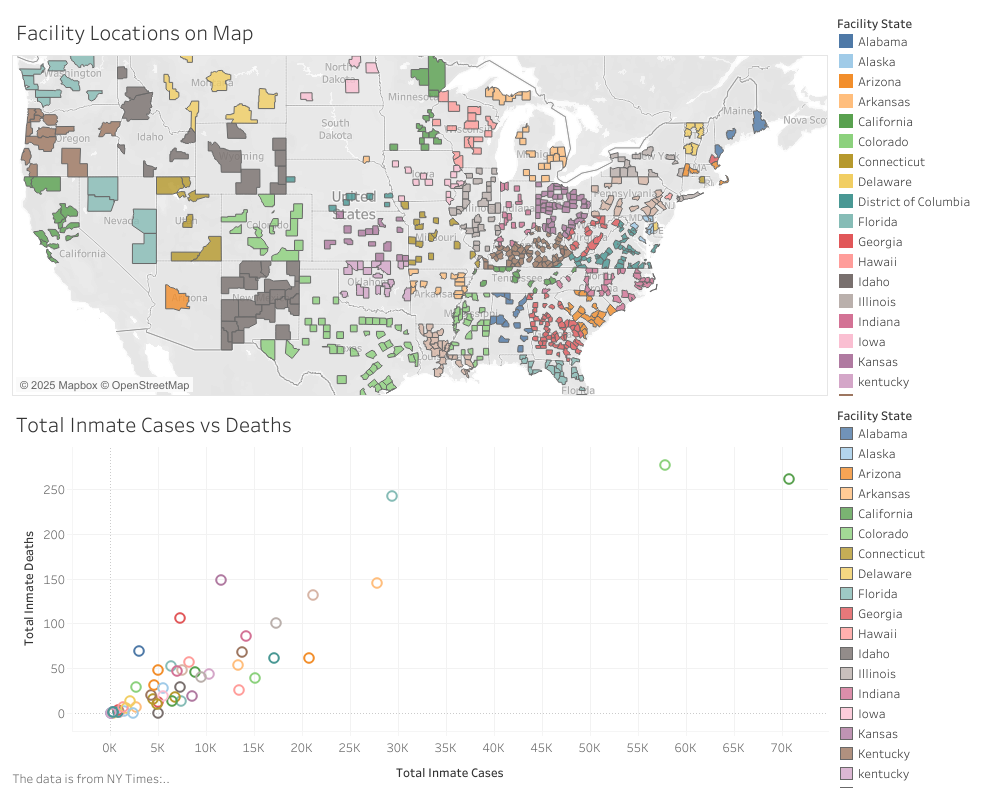

# COVID-19 Inmate Cases vs. Deaths Dashboard (Tableau)

🗺️ A Tableau visualization exploring the correlation between COVID-19 cases and deaths in U.S. prisons, jails, and detention facilities across all 50 states.

🔗 **Live Dashboard:**  
[View on Tableau Public]([https://public.tableau.com/shared/Z6BWXC4K5?:display_count=n&:origin=viz_share_link](https://public.tableau.com/app/profile/chuching.ho/viz/Book1_17179736798430/Covid-19inPrisonsJailsandDetentionFacilities))

## 📌 What This Dashboard Shows
This project answers the question:  
**How does COVID-19 affect inmates and how does this vary by geographic location and state?**

It includes:
- A **scatterplot** of total inmate cases vs deaths per state
- A **map** showing facility locations by state

## 🛠️ Interactive Features
- **Hover** to see facility details
- **Click** on a state in one chart to filter the other
- Color-coded for easier visual association

## 🧠 Insights
Users can discover which states have the highest case/death rates and explore facility locations to understand regional trends.

## 📷 Screenshot

